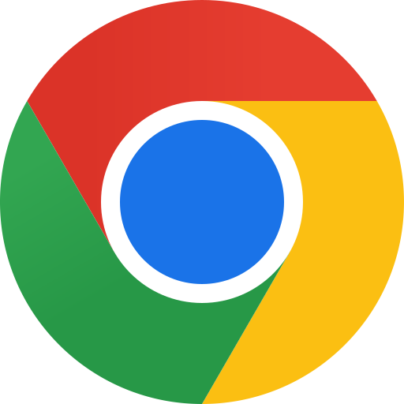
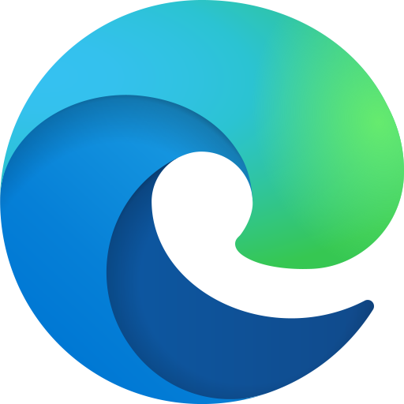

# Sourcetab

A material design dashboard for your browser's new tab page customizable with a variety of widgets and settings.

## Getting Started

Please visit [sourcetab.org/docs](https://sourcetab.org/docs) for installation instructions.

| [Web](https://web.sourcetab.org/)                                         | [Chrome](https://chrome.google.com/webstore/detail/sourcetab/akomlegpokabommpdjfmhnbdcnaefmdo)                                         | [Edge](https://microsoftedge.microsoft.com/addons/detail/sourcetab/fpknfiaimmgbbpplehjclidiphmhljeh)                                         | [Firefox](https://addons.mozilla.org/en-US/firefox/addon/sourcetab/)                                         |
| ------------------------------------------------------------------------- | -------------------------------------------------------------------------------------------------------------------------------------- | -------------------------------------------------------------------------------------------------------------------------------------------- | ------------------------------------------------------------------------------------------------------------ |
|  |  |  |  |

### Features

- Multiple types of widgets to add to the dashboard and toolbar.
- Different alignments for widgets in the toolbar.
- Easily rearrange widgets through drag and drop while in edit mode.
- Many customizable options in the settings.
- Easy data management for backup and restoration later on.

### Backgrounds

- Solid color
- Lineage gradient
- Uploaded or URL-specified image/video
- Embedded website
- Embedded YouTube video

### Widgets

- Link (easily navigate to other websites)
- Clock (display the time/date)
- Note (record simple notes throughout the day)
- IFrame (embed other websites as a widget)

## Contributing

Stars, issues, and pull requests are welcome. See [CONTRIBUTING.md](CONTRIBUTING.md) for more information.

### Firefox Build

To build the Firefox extension run `npm run build:firefox -w client`. The build files will output into `client/dist/firefox`.

## License

This project is licensed under the GPL-3.0 License. See the [LICENSE](LICENSE) file for details.
